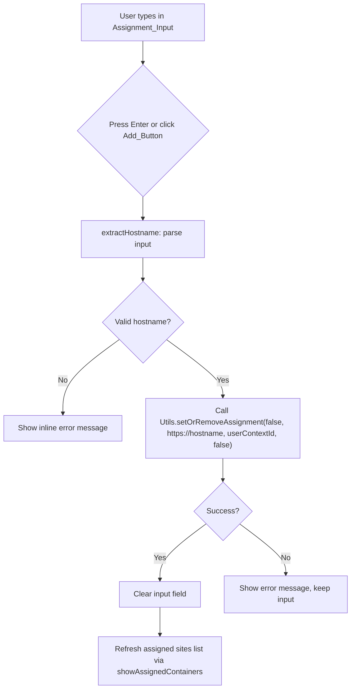

# Design Document: Manual URL Assignment

## Overview

This feature adds a manual URL input mechanism to the existing "Manage Site List" panel (`#edit-container-assignments`) in the MAC-Enhanced popup. Users can type a hostname or full URL into a text field and click a "+" button (or press Enter) to assign that site to the current container, without needing to navigate to the site first.

The implementation touches three files:
- `src/popup.html` — add the input row HTML to the assignments panel
- `src/css/popup.css` — style the input row and add button
- `src/js/popup.js` — add hostname extraction, validation, and assignment creation logic

The feature reuses the existing `Utils.setOrRemoveAssignment` API and the panel's `showAssignedContainers` method for list refresh.

## Architecture



The flow is entirely within the popup context. The background script handles the actual storage via the existing message-passing API (`setOrRemoveAssignment` → `_setOrRemoveAssignment` in `assignManager.js`). No changes to the background script are needed.

## Components and Interfaces

### 1. HTML Structure (popup.html)

A new `div.manual-assignment-row` is inserted inside `#edit-container-assignments`, between the `<hr>` and the `div.scrollable.edit-sites-assigned`. It contains:

```html
<div class="manual-assignment-row">
  <input type="text" id="manual-assignment-input"
         placeholder="Enter a website (e.g., github.com)" />
  <button id="manual-assignment-add-btn" title="Add site"></button>
  <div id="manual-assignment-error" class="manual-assignment-error hide"></div>
</div>
```

### 2. CSS Styling (popup.css)

- `.manual-assignment-row`: flex row layout with padding matching the panel's `margin-inline: 16px` pattern
- `#manual-assignment-input`: uses existing CSS variables (`--input-border-color`, `--input-bg-color`, `--text-color-primary`), `border-radius: 4px`, `block-size: 32px`, `flex: 1`
- `#manual-assignment-add-btn`: compact square button (`32px × 32px`), no text content, uses `::before` pseudo-element with `content: "+"` styled in `font-size: 18px`. Default state: subdued colors. Hover: `background-color: var(--menu-bg-hover-color)`, `color: var(--button-bg-color-primary)` (blue)
- `.manual-assignment-error`: small red text below the input row, hidden by default via the existing `.hide` class

### 3. JavaScript Logic (popup.js)

#### `extractHostname(input)` — Pure function

```
Input: string (user input from the text field)
Output: { valid: boolean, hostname: string | null }
```

Algorithm:
1. Trim the input. If empty, return `{ valid: false, hostname: null }`
2. If the input does not contain `://`, prepend `https://`
3. Attempt to construct a `URL` object from the resulting string
4. Extract `url.hostname`
5. Validate the hostname: must contain at least one dot, and match `/^[a-zA-Z0-9.-]+$/` (alphanumeric, hyphens, dots only)
6. Return `{ valid: true, hostname }` or `{ valid: false, hostname: null }`

#### `handleManualAssignment()` — Async handler

1. Read the value from `#manual-assignment-input`
2. Call `extractHostname(value)`
3. If invalid: show error message in `#manual-assignment-error`, return
4. If valid: hide error, call `Utils.setOrRemoveAssignment(false, "https://" + hostname, userContextId, false)`
5. On success: clear input, re-fetch assignments via `Logic.getAssignmentObjectByContainer(userContextId)`, call `this.showAssignedContainers(assignments)`
6. On failure: show error message, keep input value

#### Event Wiring (in the panel's `initialize` or `prepare` method)

- Click handler on `#manual-assignment-add-btn` → `handleManualAssignment()`
- Keydown handler on `#manual-assignment-input` for Enter key → `handleManualAssignment()`

Both are wired in the `prepare()` method of the `P_CONTAINERS_ACHIEVEMENT` panel (the assignments panel registered at the `edit-container-assignments` selector), since `prepare()` is called each time the panel is shown.

## Data Models

No new data models are introduced. The feature uses the existing assignment storage format managed by `assignManager.storageArea`:

```
Key: "siteContainerMap@@_{hostname}"
Value: {
  userContextId: string,
  neverAsk: boolean,
  identityMacAddonUUID: string
}
```

The `Utils.setOrRemoveAssignment(tabId, url, userContextId, value)` call with `tabId=false` and `value=false` (remove=false) creates a new assignment entry. The `tabId=false` case is already handled in `_setOrRemoveAssignment` — when `tabId` is falsy, the tab notification step is simply skipped.


## Correctness Properties

*A property is a characteristic or behavior that should hold true across all valid executions of a system — essentially, a formal statement about what the system should do. Properties serve as the bridge between human-readable specifications and machine-verifiable correctness guarantees.*

The `extractHostname` function is the core pure logic of this feature and is well-suited for property-based testing. The UI integration aspects are better covered by example-based unit tests.

### Property 1: Hostname extraction correctness

*For any* valid hostname (composed of alphanumeric segments separated by dots), and *for any* URL constructed from that hostname with an arbitrary protocol, path, query string, or fragment, `extractHostname` should return `{ valid: true, hostname }` where `hostname` matches the original hostname used to construct the URL. This also applies when the input is the bare hostname itself, or a hostname with a path but no protocol.

**Validates: Requirements 2.1, 2.2, 2.3**

### Property 2: Invalid input rejection

*For any* input that is empty, whitespace-only, or composed of characters that cannot form a valid hostname (no dots, contains spaces or special characters like `!@#$%`), `extractHostname` should return `{ valid: false, hostname: null }`.

**Validates: Requirements 2.4, 2.5**

### Property 3: Output format invariant

*For any* input where `extractHostname` returns `valid: true`, the returned hostname must contain at least one dot and consist only of characters matching `[a-zA-Z0-9.-]`.

**Validates: Requirements 2.6**

### Property 4: Assignment API call correctness

*For any* valid hostname produced by `extractHostname`, when `handleManualAssignment` is invoked, `Utils.setOrRemoveAssignment` must be called with exactly the arguments `(false, "https://{hostname}", userContextId, false)`.

**Validates: Requirements 3.1**

## Error Handling

| Scenario | Behavior |
|---|---|
| Empty or whitespace input | Show inline error: "Please enter a valid website address" |
| Input that fails hostname extraction | Show inline error: "Please enter a valid website address" |
| `Utils.setOrRemoveAssignment` rejects | Show inline error: "Failed to add site assignment", keep input value |
| URL constructor throws (malformed input) | Caught in `extractHostname`, returns `{ valid: false, hostname: null }` |

All error messages are hardcoded English strings. The error element (`#manual-assignment-error`) uses the existing `.hide` class to toggle visibility.

## Testing Strategy

### Testing Framework

The project uses Mocha + Chai + Sinon with `webextensions-jsdom` for integration tests. For property-based testing, we will use **fast-check** (a JavaScript property-based testing library compatible with Mocha).

### Unit Tests

- Verify the panel renders the input field and add button (Requirements 1.1, 1.2, 1.3)
- Verify clicking the add button with valid input calls the API and clears the field (Requirements 3.1, 3.2, 3.3)
- Verify clicking the add button with invalid input shows an error (Requirements 3.4)
- Verify pressing Enter triggers the same flow as clicking the button (Requirements 5.1)
- Verify API failure retains input and shows error (Requirements 3.5)

### Property-Based Tests

Each property test runs a minimum of 100 iterations using fast-check.

- **Feature: manual-url-assignment, Property 1: Hostname extraction correctness** — Generate random valid hostnames, wrap them in random URL formats, verify extraction returns the original hostname
- **Feature: manual-url-assignment, Property 2: Invalid input rejection** — Generate random invalid strings (whitespace, special chars, no dots), verify extraction rejects them
- **Feature: manual-url-assignment, Property 3: Output format invariant** — For any input accepted as valid, verify the hostname matches the structural constraints
- **Feature: manual-url-assignment, Property 4: Assignment API call correctness** — For any valid hostname, mock the API and verify it's called with the correct arguments
