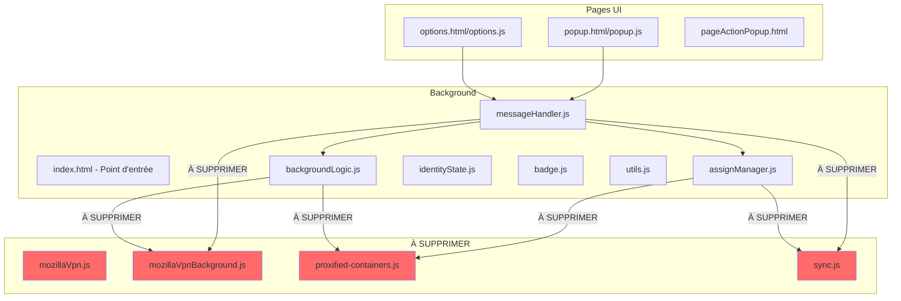
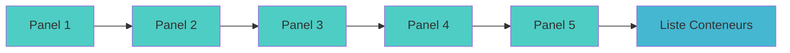

# Document de conception : Suppression VPN/Proxy et Sync

## Vue d'ensemble

Ce document décrit la conception technique pour la suppression complète des fonctionnalités VPN/Proxy Mozilla et de synchronisation (Sync) de l'extension MAC-Enhanced. L'opération consiste en trois axes principaux :

1. **Suppression de fichiers** : Supprimer les fichiers source, images et tests dédiés exclusivement au VPN/Proxy et au Sync.
2. **Modification de fichiers** : Nettoyer les références VPN/Proxy/Sync dans les fichiers partagés (JS, HTML, CSS, JSON).
3. **Nettoyage i18n** : Supprimer les clés de traduction orphelines dans les 46+ locales.

L'approche est conservative : chaque modification est ciblée pour ne retirer que le code lié au VPN/Proxy/Sync, sans altérer les fonctionnalités restantes de gestion de conteneurs.

## Architecture

L'extension MAC-Enhanced suit une architecture classique d'extension Firefox WebExtension :



### Impact sur l'architecture

Après suppression, l'architecture se simplifie :
- Le background ne charge plus que : `utils.js`, `backgroundLogic.js`, `assignManager.js`, `badge.js`, `identityState.js`, `messageHandler.js`
- Les pages UI ne chargent plus de scripts VPN/Proxy
- L'AssignManager ne gère plus de proxies ni de sync
- Le MessageHandler ne route plus de messages VPN/Sync

## Composants et interfaces

### Fichiers à supprimer entièrement

| Fichier | Raison |
|---------|--------|
| `src/js/mozillaVpn.js` | Logique UI VPN frontend |
| `src/js/proxified-containers.js` | Mapping proxy-conteneur |
| `src/js/background/mozillaVpnBackground.js` | Service VPN background |
| `src/js/background/sync.js` | Logique de synchronisation |
| `test/features/sync.test.js` | Tests sync |
| `src/img/moz-vpn-*.svg` (6 fichiers) | Images VPN |
| `src/img/onboarding-moz-vpn.svg` | Image onboarding VPN |
| `src/img/proxy-warning.svg`, `proxy-warning-light.svg` | Icônes proxy |
| `src/img/Sync.svg` | Image sync |
| `src/img/moz-vpn-status-icons/` | Répertoire icônes statut VPN |
| `src/img/flags/` | Répertoire drapeaux pays (258 PNGs) |

### Fichiers à modifier

#### 1. `src/js/background/messageHandler.js`
- Supprimer les 5 cas `MozillaVPN_*` du switch
- Supprimer le cas `resetSync`

#### 2. `src/js/background/assignManager.js`
- Supprimer `handleProxifiedRequest()` entièrement
- Supprimer `maybeAddProxyListeners()` entièrement
- Supprimer `getSyncEnabled()` entièrement
- Dans `storageArea.set()` : supprimer la ligne `data.identityMacAddonUUID = ...` et le bloc `if (backup && syncEnabled) { await sync.storageArea.backup(...) }` ainsi que la variable `syncEnabled`
- Dans `storageArea.remove()` : supprimer le bloc `const syncEnabled = ...; if (shouldSync && syncEnabled) ...`
- Dans `init()` : supprimer l'appel `this.maybeAddProxyListeners()`

#### 3. `src/js/background/backgroundLogic.js`
- Dans `resetPermissions()` : supprimer le `case "nativeMessaging"` et le `case "proxy"`
- Dans `deleteContainer()` : supprimer `proxifiedContainers.delete(...)`

#### 4. `src/js/background/index.html`
- Supprimer les 3 balises `<script>` pour `proxified-containers.js`, `mozillaVpnBackground.js`, `sync.js`

#### 5. `src/manifest.json`
- Retirer `"nativeMessaging"` et `"proxy"` de `optional_permissions`

#### 6. `src/js/utils.js`
- Supprimer la méthode `getBogusProxy()`

#### 7. `src/popup.html`
- Supprimer les panneaux d'onboarding 6, 7, 8
- Supprimer le logotype VPN dans l'en-tête
- Supprimer le fieldset proxies et `moz-vpn-container-ui` dans le formulaire d'édition

#### 8. `src/js/popup.js`
- Supprimer les enregistrements de panneaux P_ONBOARDING_6, P_ONBOARDING_7, P_ONBOARDING_8
- Supprimer les fonctions VPN : `openServerList`, `submitProxyForm`, `makeServerList`, `toggleCityListVisibility`, `checkActiveServer`
- Ajuster le flux d'onboarding : P_ONBOARDING_5 → P_CONTAINERS_LIST

#### 9. `src/options.html`
- Supprimer la section `#moz-vpn-proxy-permissions`
- Supprimer le bouton "Learn more" VPN
- Supprimer la section Sync (`#syncCheck`)
- Supprimer les balises script pour `mozillaVpn.js` et `proxified-containers.js`

#### 10. `src/js/options.js`
- Supprimer `maybeShowPermissionsWarningIcon()`
- Supprimer le handler `moz-vpn-learn-more`
- Supprimer `enableDisableSync()` et le listener `#syncCheck`
- Supprimer la logique `syncEnabled` dans `setupOptions()`

#### 11. `src/pageActionPopup.html`
- Supprimer les balises script pour `mozillaVpn.js` et `proxified-containers.js`

#### 12. `src/css/popup.css`
- Supprimer les variables CSS VPN/Proxy
- Supprimer toutes les règles `.moz-vpn-*`, `.proxy-*`, `#moz-vpn-current-server`, `#current-proxy`

#### 13. `src/css/options.css`
- Supprimer les règles `.moz-vpn-proxy-permissions`

#### 14. Fichiers i18n (46+ locales)
- Supprimer les clés VPN/Proxy et Sync de chaque `messages.json`

### Flux d'onboarding modifié



## Modèles de données

### Changements dans le stockage local

**Données supprimées :**
- `syncEnabled` (booléen) — plus utilisé
- Données de `proxifiedContainers` — plus de mapping proxy-conteneur
- `identityMacAddonUUID` dans les assignations de sites — plus nécessaire pour le sync

**Données conservées :**
- Assignations de sites (`siteContainerMap@@_*`) — sans le champ `identityMacAddonUUID`
- État des conteneurs (`identityState`)
- Raccourcis clavier
- Compteur de tabs conteneurs ouverts
- Achievements

### Changements dans le manifest.json

```json
// AVANT
"optional_permissions": ["bookmarks", "browsingData", "nativeMessaging", "proxy"]

// APRÈS
"optional_permissions": ["bookmarks", "browsingData"]
```

## Propriétés de correction

*Une propriété est une caractéristique ou un comportement qui doit rester vrai dans toutes les exécutions valides d'un système — essentiellement, une déclaration formelle sur ce que le système doit faire. Les propriétés servent de pont entre les spécifications lisibles par l'humain et les garanties de correction vérifiables par la machine.*

### Property 1 : Absence de références VPN/Proxy/Sync dans le code source

*Pour tout* fichier JavaScript restant dans le projet (hors fichiers supprimés), le fichier ne doit contenir aucune référence aux identifiants `MozillaVPN`, `MozillaVPN_Background`, `proxifiedContainers`, `sync.storageArea`, `sync.resetSync`, `sync.runSync`, `getSyncEnabled`, `maybeAddProxyListeners`, `handleProxifiedRequest`, ou `getBogusProxy`.

**Validates: Requirements 3.1, 3.2, 4.1, 4.2, 4.3, 4.4, 4.6, 5.1, 5.2, 5.3, 11.1**

### Property 2 : Persistance round-trip des assignations de sites

*Pour toute* URL valide et tout identifiant de conteneur valide, enregistrer une assignation via `storageArea.set()` puis la récupérer via `storageArea.get()` doit retourner un objet contenant les mêmes données d'assignation (userContextId, neverAsk), sans champ `identityMacAddonUUID`.

**Validates: Requirements 4.5, 14.2**

### Property 3 : Absence de clés i18n supprimées dans toutes les locales

*Pour toute* locale dans l'ensemble des locales du projet, et *pour toute* clé dans l'ensemble des clés VPN/Proxy/Sync à supprimer, le fichier `messages.json` de cette locale ne doit pas contenir cette clé.

**Validates: Requirements 13.1, 13.2**

### Property 4 : Conservation des clés i18n non-VPN/Proxy/Sync

*Pour toute* locale dans l'ensemble des locales du projet, le nombre de clés dans le fichier `messages.json` après nettoyage doit être égal au nombre de clés avant nettoyage moins le nombre de clés VPN/Proxy/Sync qui existaient dans cette locale.

**Validates: Requirements 13.3**

### Property 5 : Intégrité du flux d'onboarding

*Pour tout* état d'onboarding valide, la progression depuis le panneau 5 doit mener directement à la liste des conteneurs (P_CONTAINERS_LIST), sans passer par des panneaux intermédiaires 6, 7 ou 8.

**Validates: Requirements 8.5, 14.3**

### Property 6 : Traitement correct des messages restants

*Pour tout* message valide parmi les cas restants du MessageHandler (getShortcuts, setShortcut, deleteContainer, createOrUpdateContainer, etc.), le handler doit retourner une réponse sans lever d'erreur de référence à des modules supprimés.

**Validates: Requirements 3.3, 14.4**

## Gestion des erreurs

### Risques identifiés

1. **Références pendantes** : Un fichier modifié pourrait encore référencer un module supprimé. Mitigation : la Property 1 vérifie l'absence de toutes les références connues.

2. **Flux d'onboarding cassé** : La suppression des panneaux 6-8 pourrait casser la navigation. Mitigation : ajuster explicitement la transition P_ONBOARDING_5 → P_CONTAINERS_LIST.

3. **CSS orphelin** : Des sélecteurs CSS pourraient référencer des éléments HTML supprimés. Impact faible (CSS mort ne cause pas d'erreur), mais nettoyé par souci de propreté.

4. **Clés i18n manquantes** : Si une clé i18n est encore référencée dans le HTML/JS mais supprimée des traductions, Firefox affichera la clé brute. Mitigation : vérifier que toutes les clés supprimées ne sont plus référencées dans le code.

### Stratégie de rollback

Chaque modification est indépendante et peut être annulée via git. L'ordre d'exécution (suppression de fichiers d'abord, puis modifications) minimise les conflits.

## Stratégie de test

### Approche duale

**Tests unitaires (exemples spécifiques) :**
- Vérifier l'absence de chaque fichier supprimé
- Vérifier l'absence de balises script supprimées dans les HTML
- Vérifier l'absence de sections HTML supprimées (panneaux onboarding, fieldsets proxy, sections options)
- Vérifier que le manifest ne contient plus `nativeMessaging` ni `proxy`
- Vérifier le flux d'onboarding 5 → liste conteneurs

**Tests property-based (propriétés universelles) :**
- Bibliothèque recommandée : `fast-check` (JavaScript)
- Minimum 100 itérations par test
- Chaque test annoté avec le numéro de propriété

**Configuration des tests property-based :**
- Tag format : **Feature: remove-vpn-proxy-and-sync, Property {N}: {titre}**
- Chaque propriété de correction correspond à un seul test property-based

**Répartition :**
- Property 1 (absence de références) : grep/scan automatisé sur tous les fichiers JS restants
- Property 2 (round-trip assignations) : test property-based avec `fast-check` générant des URLs et userContextIds aléatoires
- Property 3 (absence clés i18n) : test property-based itérant sur toutes les locales × toutes les clés supprimées
- Property 4 (conservation clés i18n) : test property-based vérifiant le compte de clés par locale
- Property 5 (flux onboarding) : test unitaire vérifiant la transition
- Property 6 (messages restants) : test property-based envoyant des messages aléatoires parmi les cas valides
